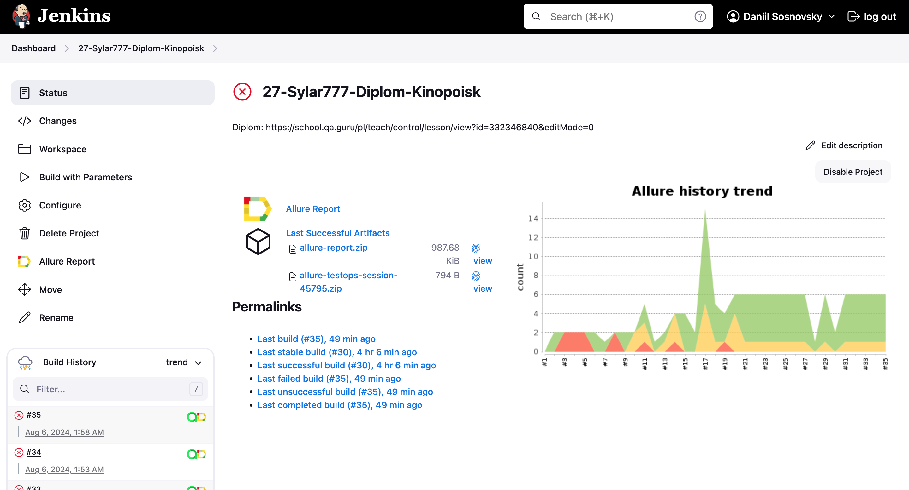
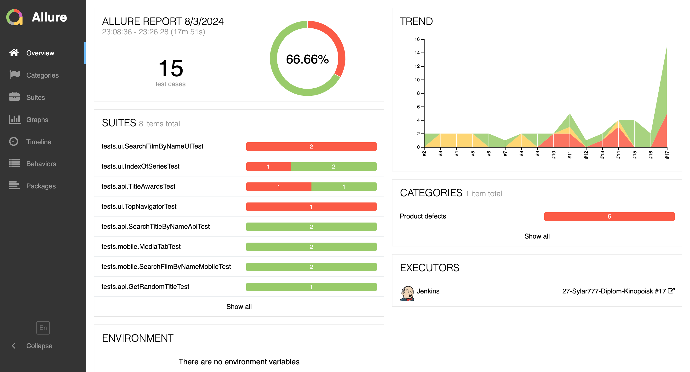
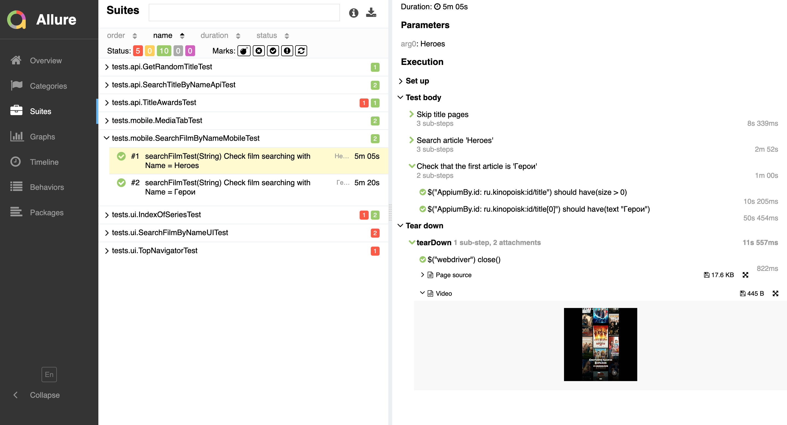
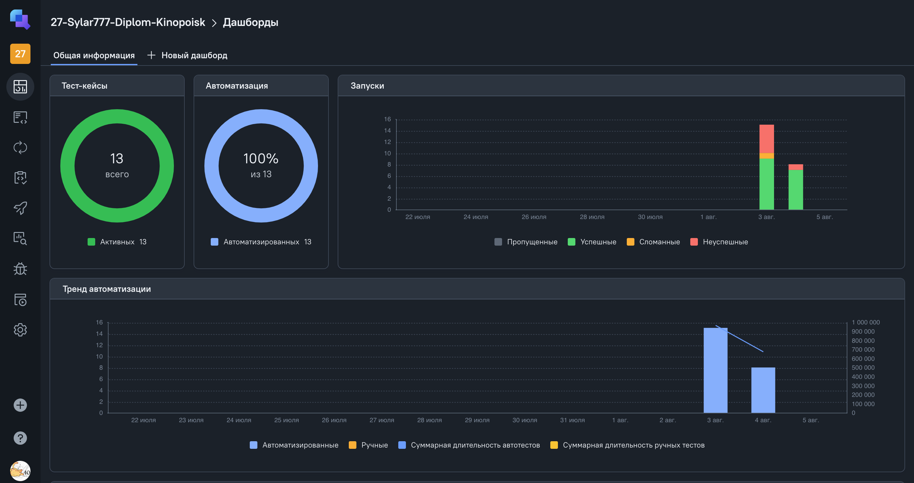
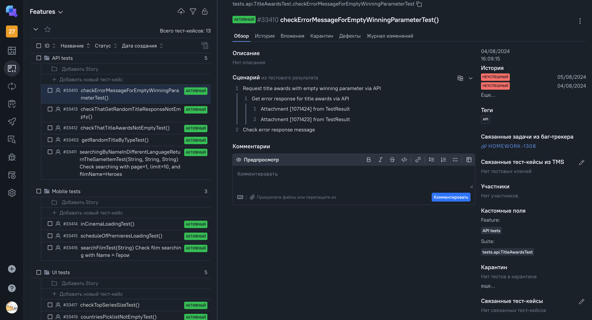
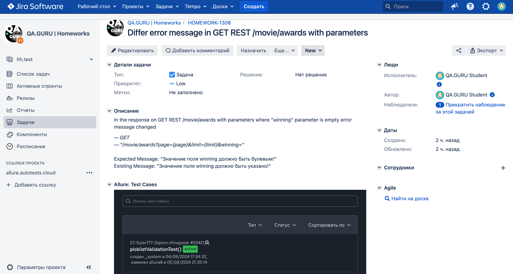
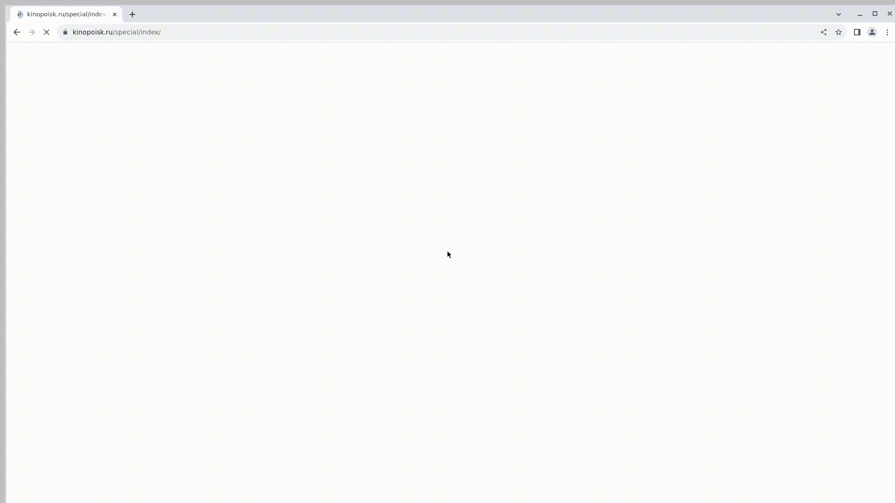
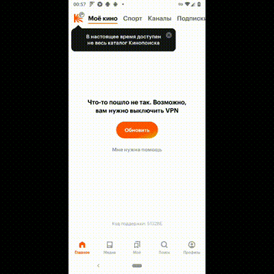

# Проект автоматизации тестирования [Kinopoisk](https://www.kinopoisk.ru/)

## Описание ресурса Kinopoisk
Kinopoisk - это крупнейший российский интернет-сервис, посвященный кино и телевидению. Платформа предоставляет пользователям обширную базу данных фильмов, сериалов, актеров и режиссеров, а также позволяет оставлять отзывы, рейтинги и участвовать в обсуждениях. Kinopoisk является ключевым ресурсом для киноманов, предлагая последние новости киноиндустрии и подробную информацию о предстоящих релизах.


## Содержание
- [Описание](#описание)
- [Технологии и инструменты](#технологии-и-инструменты)
- [Реализованные проверки](#реализованные-проверки)
- [Локальный запуск тестов](#локальный-запуск-тестов)
- [Сборка тестов в Jenkins](#сборка-тестов-в-jenkins)
- [Интеграция с Allure Report](#интеграция-с-allure-report)
- [Интеграция с Allure TestOps](#интеграция-с-allure-testops)
- [Интеграция с Jira](#интеграция-с-jira)
- [Видео примера запуска тестов в Selenoid](#Видео-примера-запуска-тестов-в-Selenoid)
- [Видео примера запуска тестов в BrowserStack](#Видео-примера-запуска-тестов-в-BrowserStack)

## Описание
Проект по автоматизации тестирования Kinopoisk нацелен на демонстрацию возможностей автоматизации одного сервиса с различных сторон, включая UI, API и Mobile. 
Цель проекта - предоставить комплексный подход к автоматизации, охватывая все основные аспекты и обеспечивая высокое качество тестирования. 

Проект включает в себя тесты на:
- Автоматизацию пользовательского интерфейса (UI)
- Автоматизацию тестирования API
- Автоматизацию тестирования мобильного приложений

А также всключает в себя всю сопутствующая инфраструктуру:
- Jenkins
- Allure
- Selenoid
- TestOps
- Jira 
 
## Технологии и инструменты

<div align="center" dir="auto">
<a href="https://www.jetbrains.com/idea/" rel="nofollow"></a>
<a href="https://github.com/"></a>  
<a href="https://www.java.com/" rel="nofollow"></a>
<a href="https://gradle.org/" rel="nofollow"></a>  
<a href="https://junit.org/junit5/" rel="nofollow"></a>
<a href="https://selenide.org/" rel="nofollow"></a>
<a href="https://aerokube.com/selenoid/" rel="nofollow"></a>
<a href="https://rest-assured.io/" rel="nofollow"></a>
<a href="https://www.browserstack.com/" rel="nofollow"></a>
<a href="https://appium.io/" rel="nofollow"></a>
<a href="https://developer.android.com/studio" rel="nofollow"></a>
<a href="https://www.jenkins.io/" rel="nofollow"></a>
<a href="https://github.com/allure-framework/"></a>
<a href="https://qameta.io/" rel="nofollow"></a>
<a href="https://www.atlassian.com/software/jira" rel="nofollow"></a>  
<a href="https://telegram.org/" rel="nofollow"></a>
</div>

## Реализованные проверки
**UI**
- Проверка отображения полного списка лучших сериало на странице
- Проверка на не пустой пиклист Страна на странице Топ Сериалов
- Проверка применения фильтра Страна на список отображаемых на странице фильмов
- Проверка валидации на пиклист Бюджет
- Параметризованный тест на независимость поиска на русском и английском языках

**API**
- Проверка ответа на непустой список наград
- Проверка текста ошибки при запросе списка наград
- Проверка непустого ответа при запросе рандомного фильма
- Проверка применения фильтра при запросе рандомного фильма с указанием его типа
- Параметризованный тест на независимость поиска на русском и английском языках

**Mobile**
- Проверка отображения фильмов в карусели "В кино"
- Проверка отображения фильмов в карусели "Премьера"
- Параметризованный тест на независимость поиска на русском и английском языках

## Локальный запуск тестов
Для запуска следует открыть IntelliJ IDEA и выполнить в терминале:


Для запуска API тестов

``` bash
gradle clean api_tests
```

Для запуска UI тестов

``` bash
gradle clean ui_tests
```

Для запуска Mobile тестов

``` bash
gradle clean mobile_tests
```

Для запуска всех тестов

``` bash
gradle clean all_tests
```

## Сборка тестов в [Jenkins](https://jenkins.autotests.cloud/job/27-Sylar777-Diplom-Kinopoisk/)
Для запуска сборки необходимо перейти в раздел Build with Parameters и нажать кнопку Build. Сборка с параметрами позволяет перед запуском задать нужные параметры для сборки:

**Параметры запуска:**
```
clean
${TAG}
-Denv=${PLATFORM}
-Dwdhost=${URL}
-Dbrowser=${BROWSER}
-DBrowserVersion=${BROWSER_VERSION}
-DbrowserSize=${BROWSER_SIZE}
-DbaseUrl=${BASE_URL}
-DbaseAPIUrl=${BASE_API_URL}
-Dapikey=${X_API_KEY}
```

Для запуска сборки необходимо перейти в раздел Собрать с параметрами, задать параметры и нажать кнопку Собрать.

<p dir="auto">
  <a href="images/screenshots/Jenkins.png">
    
  </a>
</p>

После выполнения сборки, в блоке История сборок напротив номера сборки появятся значек Allure Report, при клике на который откроется страница со сформированным html-отчетом и тестовой документацией соответственно, а так же появятся значек Allure TestOps при клике на который откроется страница проекта в Allure TestOps.

## Интеграция с [Allure Report](https://jenkins.autotests.cloud/job/27-Sylar777-Diplom-Kinopoisk/30/allure/)
**Диаграммы прохождения тестов**
ALLURE REPORT - отображает дату и время теста, общее количество запущенных тестов, а также диаграмму с процентом и количеством успешных и провалившихся тестов
TREND - отображает тенденцию выполнения тестов
SUITES - отображает распределение тестов по сьютам
CATEGORIES - отображает распределение неудачных тестов по типам дефектов

<p dir="auto">
  <a href="images/screenshots/AllureReport.png">
    
  </a>
</p>

**Развернутый результат прохождения тестов:**

<p dir="auto">
  <a href="images/screenshots/AllureResult.png">
    
  </a>
</p>

## Интеграция с [Allure TestOps](https://allure.autotests.cloud/project/4350/dashboards)
**Диаграммы прохождения тестов**

<p dir="auto">
  <a href="images/screenshots/TestOpsDashbord.png">
    
  </a>
</p>

**Тест кейсы**

<p dir="auto">
  <a href="images/screenshots/TestOpsTests.png">
    
  </a>
</p>

## Интеграция с [Jira](https://jira.autotests.cloud/)
**Создана задача в Jira**

<p dir="auto">
  <a href="images/screenshots/Jira.png">
    
  </a>
</p>

## Видео примера запуска тестов в Selenoid
<p dir="auto">
  <a href="images/screenshots/Jira.png">
    
  </a>
</p>

## Видео примера запуска тестов в BrowserStack
<p dir="auto">
  <a href="images/screenshots/Jira.png">
    
  </a>
</p>
